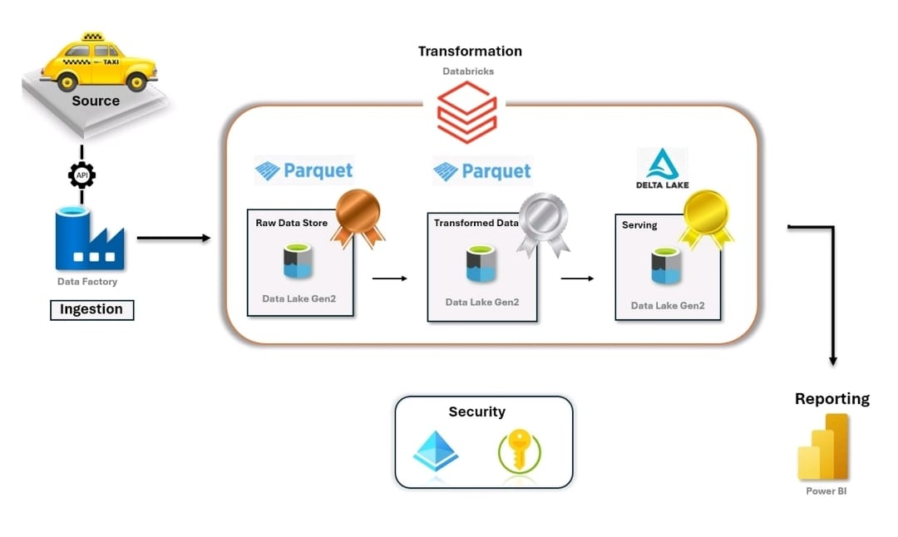

# End-to-End Azure Data Engineering Project using Medallion Architecture | NYC Taxi Data
## Introduction
This project demonstrates an end-to-end Azure Data Engineering solution using the Medallion Architecture (Bronze, Silver, Gold layers) with NYC Taxi data. It includes data ingestion with a dynamic pipeline in Data Factory, transformations and creation of Delta tables in Databricks, storage in Data Lake, and connecting the transformed, analysis-ready data to Power BI.
## Architecture

## Dataset Used
2023 Green taxi trip records were used which include fields capturing pick-up and drop-off dates/times, pick-up and drop-off locations, trip distances, itemized fares, rate types, payment types, and driver-reported passenger counts.
Dataset link - (https://www.nyc.gov/site/tlc/about/tlc-trip-record-data.page)
## Implementation
### Azure Data Lake Storage Gen 2 (ADLS) : 
+ Three containers were created in ADLS to implement the Medallion Architecture: Bronze, Silver, and Gold. Each layer stores data at different stages of processing.
  - Bronze Layer
    > Stores raw NYC Taxi data in its original format (e.g., CSV, Parquet).
    > Data is ingested using a dynamic pipeline in Azure Data Factory and organized by a folder structure.
    > 
  - Silver Layer
    > Contains cleaned and validated data processed in Databricks.
    > Performed splitting and selection of certain columns, correcting data types, and standardizing timestamps.
    > Data is stored in Parquet format.
    > 
  - Gold Layer
    > Stores transformed and aggregated data as Delta tables.
    > Performed querying, versioning and time-travel on delta tables.
    > Contains analytics-ready data.
    > 
### Azure Data Factory (ADF)
+ Azure Data Factory was used to orchestrate the data ingestion process with a dynamic pipeline that pulls each month's NYC Taxi data directly from the source API.
  - The pipeline utilizes ForEach and If-condition activities to handle monthly data ingestion dynamically.
  - Copy activity is used to pull raw data from the API and store it in the Bronze layer of ADLS.
    > 
    > 
    > 
    > 
### Service Principal
+ A Service Principal was created to securely authenticate and authorize access between Azure Databricks and Azure Data Lake Storage (ADLS).
  > It is assigned appropriate permissions on the ADLS containers to ensure secure access to the raw, cleaned, and transformed data in the Bronze, Silver, and Gold layers.
### Azure Databricks
+ In Databricks, workspace notebooks were created to process and transform the data, using the Service Principal for secure access to Azure Data Lake Storage (ADLS).
  - Data was read from the Bronze layer, with transformations applied such as cleaning, correcting data types and standardizing timestamps.
  - The transformed data was then stored in the Silver layer.
  - The data was further read from the Silver layer, Delta tables were created to enable features like querying, versioning, and time-travel.
  - The final analytics-ready data was stored in the Gold layer.
+ Transformation scripts:
  - [Silver notebook](https://github.com/Mohamed-Shadi/azure-project2-nyctaxi/blob/main/silver_notebook.ipynb)
  - [Gold notebook](https://github.com/Mohamed-Shadi/azure-project2-nyctaxi/blob/main/gold_notebook.ipynb)
### Connecting Power BI
+ A connection was established between Databricks and Power BI Desktop to connect the Delta tables in the Gold layer for visualization.
  - The connection file was downloaded from Databricks and imported into Power BI Desktop.
  - Data analysts can now query the transformed and aggregated data in Power BI to perform visualizations and generate insights.
    > 

